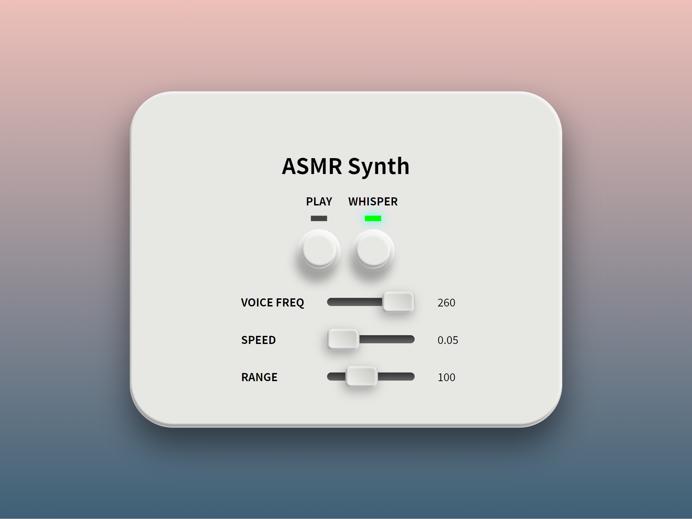

# ASMR Synth

ASMR Synth is a real-time voice generation app designed to create soothing ASMR audio. Perfect for relaxation, sleep aid, and focus, this app lets you generate calming ASMR sounds with ease. Whether you're looking to immerse yourself in gentle whispers or soft-spoken words, ASMR Synth provides a customizable, relaxing experience at your fingertips.

- **Real-Time ASMR Voice Generation:** Generate ASMR sounds in real-time.
- **Whisper Mode:** Switch to a whisper voice for softer effects.
- **Customizable Frequency, Pace, and Range of Motion:** Control the pitch, speaking speed, and spatial movement of the ASMR voice.
- **User-Friendly Interface:** Simple and intuitive UI for easy adjustments.

## 1. Demo

[Live Demo (https://olimot.github.io/asmr-synth)](https://olimot.github.io/asmr-synth)



## 2. Usage

1. **Play / Stop Button:**
   - Press the PLAY button to start generating ASMR sounds.
   - Press it again to stop the sound.
2. **Whisper Mode:**
   - Toggle the WHISPER switch to change the voice to a whisper without adjusting the volume.
   - This mode creates a softer, more soothing ASMR effect by using a whispering sound instead of a regular speaking voice.
3. **Voice Frequency (VOICE FREQ):**
   - Adjust the VOICE FREQ slider to control the frequency of the ASMR voice.
   - A higher frequency produces a higher pitch, while a lower frequency produces a deeper sound.
4. **Speed:**
   - The PACE slider controls the speaking rate and the movement speed of the sound source.
   - Increasing the pace will result in a faster speaking tempo and quicker movement, creating a dynamic, immersive ASMR experience.
5. **Range:**
   - The RANGE slider adjusts the area within which the sound source can randomly move.
   - Increasing this setting allows the sound to travel across a wider space, adding variation in the perceived location of the sound for a more engaging ASMR experience.

## 3. Installation

Follow these steps to set up and run ASMR Synth locally:

```sh
# Clone the repository:
git clone https://github.com/your-username/asmr-synth.git
cd asmr-synth

# ASMR Synth is built with Vite, so you just need to install the required packages:
npm i

# To start the app in development mode, run:
npm run dev
```

## 4. License

This project is licensed under the MIT License. You are free to use, modify, and distribute this software, as long as the original copyright notice and this permission notice are included in all copies or substantial portions of the software.

For more details, see the [LICENSE](LICENSE) file.

## 5. Acknowledgements

This project was inspired by [Pink Trombone](https://dood.al/pinktrombone/), originally created by Neil Thapen in 2017.

Many thanks to Neil Thapen for his creative work on Pink Trombone, and to the team at IMAGINARY for [their open-source implementation](https://github.com/IMAGINARY/pink-trombone), which provided valuable guidance for ASMR Synth.
